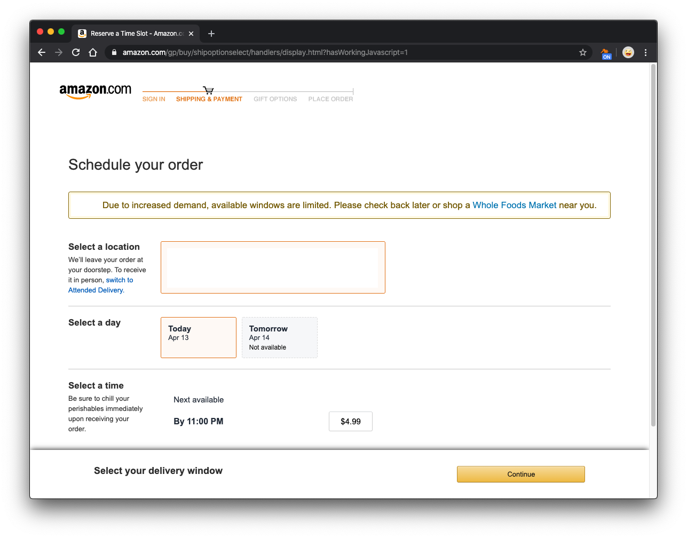
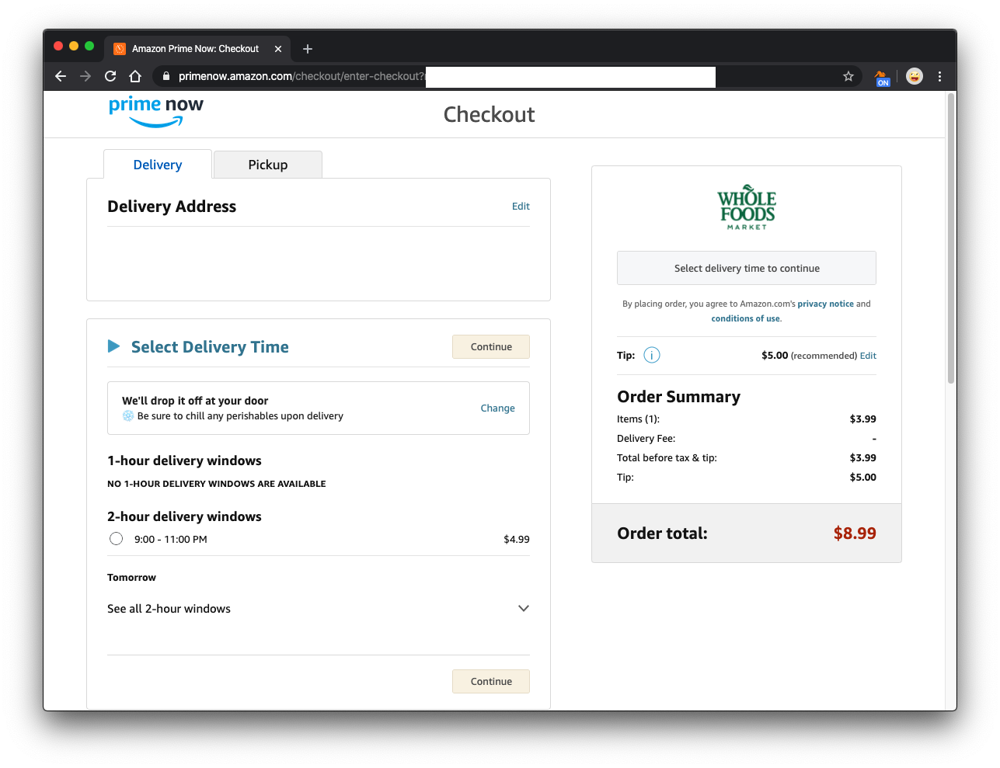
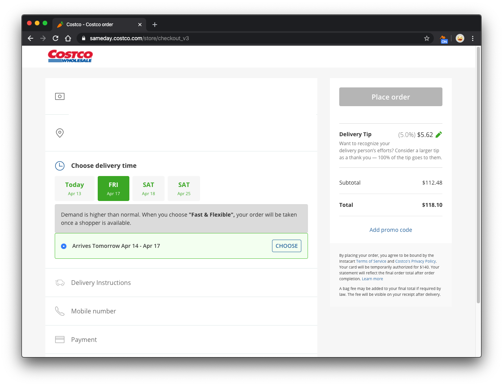
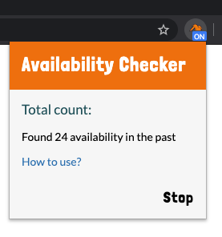
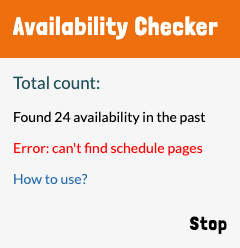

# Delivery Availability Checker - Tutorial

# Tutorial

Please Do NOT abuse this extension and please HELP THOSE IN NEED during these tough times! 

### Step 1. Install the extension

Use chrome web store to install 

### Step 2. Open grocery website and add the items you want

### Step 3. Go to order schedule page

*In order to find availability, you must go to these schedule pages.*

Order schedule page of Amazon.com 

Order schedule page of Amazon Prime Now 

Order schedule page of Costco sameday 

Order schedule page of Instacart 

### Step 4. Turn on the extension

### Step 5. Notify when an availability found

You will hear an [alert sound](../audio/notification.ogg) also. 

# Troubleshooting

### #1. An error on the panel

If you see "Error: can't find schedule pages", you need to goto Step #3 to make sure you have opened the schedule page.

### #2. How to make sure it's running?

Method A: If you have opened the schedule pages, you can click the start button of this extension. If the pages you opened refresh after you hit the start button, it works well.

Method B: Check if the schedule pages automatically refresh at a random time, if so it works well.

# Feedback

